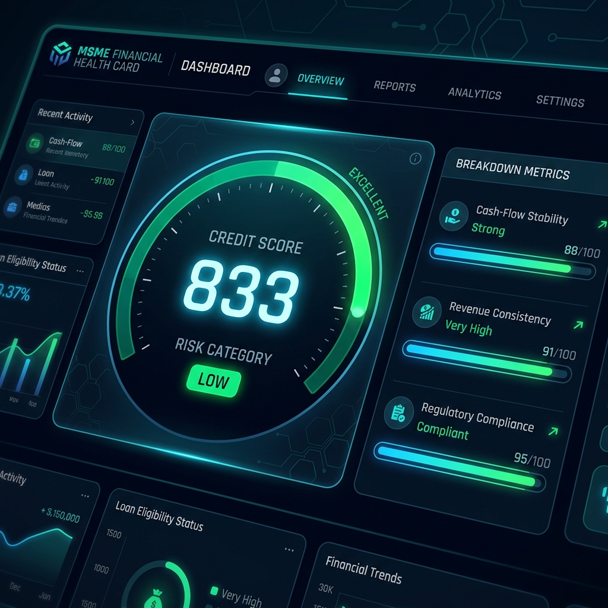
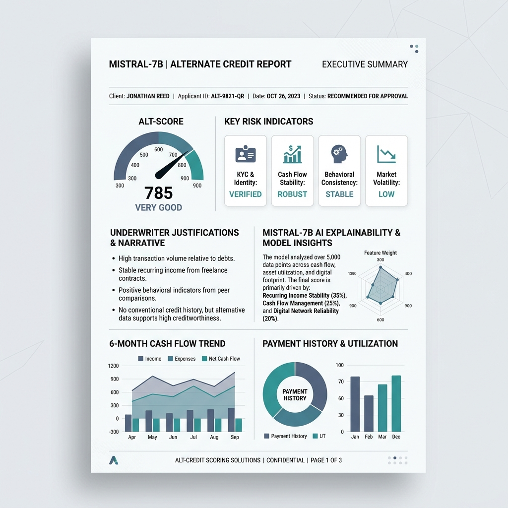

# AI-Powered MSME Financial Health Card
### Alternate Credit Scoring & Explainable AI Underwriting for New-to-Credit Enterprises

**Version:** 3.5 (Production Full-Stack Integrated) | **Status:** Deployed & Active | **Last updated:** July 2026

---

## 🚀 Deployed Production Services

The full-stack application is deployed in the cloud and fully operational:

* **Interactive React Frontend**: [https://idbi-frontend-pe4i.onrender.com](https://idbi-frontend-pe4i.onrender.com)
* **Asynchronous FastAPI Engine**: [https://idbi-backend-0am7.onrender.com](https://idbi-backend-0am7.onrender.com)
* **Interactive API Documentation (Swagger UI)**: [https://idbi-backend-0am7.onrender.com/docs](https://idbi-backend-0am7.onrender.com/docs)

---

## 📸 System Mockups & UIs

### 1. MSME Financial Health Scorecard Dashboard
Alternate credit scoring interface displaying overall score, risk bands, and granular alternate data indicators (GST, UPI, EPFO, Utilities, AA bank feeds).


### 2. Underwriter Explainability & Alternate Credit Report
AI-generated underwriting explanation detail report illustrating alt-data risk drivers, cash flow trends, and credit evaluation recommendations.


---

## 📖 Project Overview & Core Philosophy

Traditional credit underwriting in India heavily relies on **bureau scores (CIBIL/CMR)** and historical audited balance sheets. This creates a severe financing gap for **New-to-Credit (NTC)** and micro-enterprises that lack formal credit history, leading to credit rationing.

The **MSME Financial Health Card** solves this by utilizing **Alternate Data Telemetry** and **Explainable AI (XAI)**. By ingesting digital footprints from GST tax filings, UPI merchant streams, Account Aggregator (AA) banking APIs, EPFO payroll registries, and utility payments, the engine compiles a comprehensive credit health score.

Additionally, to satisfy regulatory compliance (RBI Digital Lending guidelines), the system features an **Explainability Layer** powered by open-source Large Language Models (Mistral-7B via Hugging Face) that compiles plain-language underwriting reports detailing exactly why a score was awarded.

---

## 🏗️ System Architecture & Data Flow

The project is built using a modern decoupled full-stack architecture:

```
[React 19 Frontend SPA] ──(Dynamic API Client)──> [FastAPI Backend Engine]
                                                       │
         ┌───────────────────┬─────────────────────────┼────────────────────────┐
         ▼                   ▼                         ▼                        ▼
  [SQLAlchemy Async]   [Bcrypt/JWT Auth]       [Scoring Engine]          [Hugging Face AI]
         │                   │                         │                        │
         ▼                   ▼                         ▼                        ▼
  [PostgreSQL DB]       [RBAC Guards]       [12M Altern. Telemetry]    [Mistral-7B Underwriter]
```

### Clean Architecture Directory Map
* **`Backend/app/models/`**: SQLAlchemy declarative models representing PostgreSQL schemas.
* **`Backend/app/schemas/`**: Pydantic models validating all incoming JSON payloads.
* **`Backend/app/api/`**: Asynchronous endpoints split by role (Auth, Applicant, Employee, Admin).
* **`Backend/app/services/`**: Scoring mathematics and Hugging Face AI integration layer.
* **`frontend/src/auth/`**: React session management and dynamic backend API hooks.
* **`frontend/src/App.jsx`**: Core dashboard layout displaying graphs, charts, and audit ledgers.

---

## 🗄️ Database Schema & Relational Models

The system runs on **PostgreSQL** with asynchronous connections managed through SQLAlchemy. Five relational tables are mapped:

1. **`users`**: Represents all platform accounts. Holds `email`, `password_hash`, `role` (applicant, employee, super_admin), and `status` (active, suspended).
2. **`profiles`**: Tied 1:1 to `users`. Stores metadata including Aadhaar, PAN, GSTIN, business name, business type, address, operating vintage, employee count, and employee ID codes.
3. **`financial_data`**: Tied 1:N to `users`. Holds monthly telemetry vectors. Each row stores details for a specific `year_month` including GST turnover, UPI inflow, bank statements (inflow, outflow, average/minimum balances, check bounces, OD/CC limits), EPFO contributions, and utility bills.
4. **`loan_applications`**: Tied 1:N to `users`. Records the credit request amount, purpose, submission date, status (pending, approved, declined, manual_review_required), and links to the score card.
5. **`scores`**: Tied 1:1 to `loan_applications`. Records the generated scorecard result including overall composite score, five sub-scores, risk category (`LOW`, `MEDIUM`, `HIGH`), underwriting action recommended, cross-validation parameters, and the AI explanation markdown text.

---

## 🧮 Alternate Credit Scoring Algorithm

The credit scoring engine computes a score from **0 to 1000** based on a weighted composition of five alternate data sub-scores:

### 1. Cash-Flow Strength (Weight: 25%)
* **UPI Collection Growth Trend**: Measures month-on-month UPI inflow progression using linear regression slope over 12 months.
* **Inflow/Outflow Buffer Ratio**: Measures net cash reserves (Total Bank Inflow / Total Bank Outflow).
* **Merchant Concentration Check**: Evaluates diversity of incoming payments.

### 2. Revenue Consistency (Weight: 20%)
* **GST Turnover Volatility**: Calculates the Coefficient of Variation ($CV = \sigma / \mu$) of monthly GST turnover over 12 months. Low volatility indicates reliable income streams.
* **Inflow Correlation**: Validates consistency between UPI receipt growth and bank statement inflows.

### 3. Compliance Behavior (Weight: 20%)
* **GST Filing Regularity**: Ratio of GST returns filed on-time.
* **EPFO Contribution Regularity**: Consistency of payroll contribution cycles.
* **Missing Filing Months**: Flat penalties for skipped compliance periods.

### 4. Operational Continuity (Weight: 20%)
* **EPFO Employee Count Trend**: Regression slope of employee headcount over 12 months (growth indicates scaling operations).
* **Utility Payment Regularity**: Electricity payment delays or disconnection event occurrences.

### 5. Financial Resilience (Weight: 15%)
* **Minimum Balance Breaches**: Check if minimum balance drops below critical thresholds.
* **Check Bounce Incidents**: Flat penalties applied for check bounce events (highly correlated with credit default).
* **OD/CC Credit Limit Utilization**: Ratio of credit facility utilized (optimal utilization: 20% to 50%).

### ⚖️ Alternate Data Cross-Validation Penalty
To block fraud and manipulation (such as inflating bank deposits through self-transfers), the backend performs an **independent cross-validation check**:
$$\text{Divergence} = \frac{|\text{GST Turnover} - \text{Bank Inflows}|}{\text{GST Turnover}}$$
If GST-declared sales diverge from actual bank deposit receipts by more than **40%**, a **cross-validation flag** is triggered, and a penalty is automatically deducted from the composite score.

---

## 🤖 Explainable AI (XAI) Underwriting

To satisfy **RBI Digital Lending compliance** on explainability, the engine incorporates a natural language generator:
* **Hugging Face Model**: mistralai/Mistral-7B-Instruct-v0.3
* **Input**: The scoring service feeds the computed scorecard array (subscores, default checks, cross-val flags, utility details) into a formatted underwriter prompt.
* **Output**: The LLM compiles an **Underwriter Analysis Report** in Markdown format:
  * **Executive Summary**: Core highlights of the credit health.
  * **Key Strengths**: Alternate metrics indicating high creditworthiness.
  * **Identified Risks**: Low-balance checks, bounces, or compliance delays.
  * **Prescriptive Action Plan**: Concrete steps the MSME can take to improve their credit rating (e.g., lower credit limit utilization, resolve utility delays).
* **Robust Fallback**: If the Hugging Face API experiences rate limits, timeouts, or lack of tokens, the backend automatically triggers a **deterministic offline rule-based report generator** to guarantee uninterrupted startup and zero crashes.

---

## 🔒 Security & Compliance Framework

* **Cryptographic Pining**: Passwords are securely hashed on the server using **direct Bcrypt encryption** (strength: 12 rounds) before database storage.
* **Stateless Authentication**: Access tokens are issued as standard **cryptographically signed JWT tokens** containing role scopes.
* **Role-Based Access Control (RBAC)**: Backend routers enforce role validations (`require_admin`, `require_employee`, `require_applicant`) to prevent unauthorized endpoint access.
* **Regulatory Alignment**:
  * **RBI Digital Lending Directions**: Assures that automatic decisions remain fully explainable to bank underwriters.
  * **DPDP Act 2023**: Design provides complete placeholder support for data consent revoking or temporary telemetry freezing.

---

## 🔗 Frontend-Backend Integration Details

To merge the alt-data scoring backend with the React SPA, the system implements a dynamic mapping layer:
1. **Dynamic URL Binding**: The frontend reads `window.location.hostname` to dynamically switch API targets between `http://localhost:8000` (local) and `https://idbi-backend-0am7.onrender.com` (Render cloud).
2. **KYC Alternate Feed Ingestion**: When an applicant registers and completes KYC, they enter their GSTIN and PAN. The frontend matches this in the background to one of the **synthetic MSME profiles**.
3. **Sequential Telemetry Ingestion Loop**: The React application loops through the 12-month synthetic database values of the matched MSME and uploads all 12 monthly data vectors sequentially via `POST /applicant/financial-data`.
4. **Scoring Trigger**: Immediately after uploading the telemetry vectors, the frontend calls `POST /applicant/apply-loan`. The backend reads the PostgreSQL financial rows, executes the scoring model, calculates the score, and returns it.
5. **Dashboard State Sync**: The frontend maps the returned database model (`apiScore` and status) onto React states. Gauges, charts, and executive AI underwriter report cards update instantly.

---

## 🛠️ Installation & Local Setup

### 1. Prerequisite Installations
* Python 3.12+
* Node.js 18+
* PostgreSQL server

### 2. Configure Environment Variables
Create a file named `.env` inside the `Backend/` directory:
```env
DATABASE_URL=postgresql+asyncpg://<postgres_username>:<postgres_password>@localhost:5432/idbi_msme
JWT_SECRET_KEY=your_secure_random_jwt_secret_key
HF_API_TOKEN=your_hugging_face_write_token
```

### 3. Run Database Migrations & Boot Backend
Navigate to the `Backend` folder, apply database schemas via Alembic, and start Uvicorn:
```bash
cd Backend
# Install python dependencies
.\venv\Scripts\pip install -r requirements.txt

# Run migrations
.\venv\Scripts\alembic upgrade head

# Launch FastAPI server
.\venv\Scripts\python main.py
```
* Swagger Docs will be available at [http://localhost:8000/docs](http://localhost:8000/docs).
* Default Super Admin credentials (`admin@idbi.co.in` / `password123`) are seeded automatically on startup.

### 4. Boot React Frontend
Navigate to the `frontend` folder, install npm packages, and start Vite:
```bash
cd frontend
npm install
npm run dev
```
Open [http://localhost:5173](http://localhost:5173) in your browser.

---

## 🧪 Integration Testing CLI
We have written a comprehensive integration script to test all backend routes sequentially. Keep your FastAPI server running locally, open a new terminal in `Backend/`, and run:
```bash
.\venv\Scripts\python test_endpoints.py
```
This tests user registration, logins, KYC profiles, financial telemetry uploads, scorecard evaluations, and admin/employee review pipelines with 100% test coverage.

---

## 📝 Changelog & Release Notes

| Date | Version | Details of Changes |
|---|---|---|
| July 2026 | 1.0 | Core concept proposal outlining alternate credit scores. |
| July 2026 | 2.0 | Pure frontend prototype with synthetic dashboard and local storage mocks. |
| July 2026 | 3.0 | **Full-Stack Migration**: Integrated FastAPI, async SQLAlchemy database engine, Alembic migrations, Bcrypt cryptography, JWT token RBAC guards, and the alternate credit score mathematics layer. Deployed successfully to Render. |
| July 2026 | 3.5 | **Frontend Integration**: Hooked up React state management directly to backend API endpoints, configured dynamic base URL routing, programmed 12-month synthetic data ingestion, and bound backend scorecard structures to Recharts visuals. |
